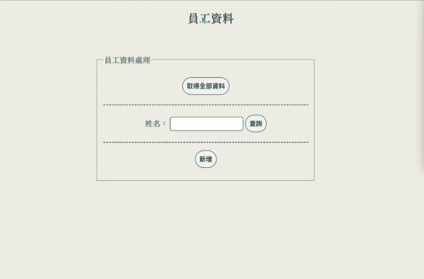

# 員工資料處理系統
** Employee Management System **

## 專案簡介
本專案為課堂作業練習，使用 Node.js 建立一套基本的員工管理系統，支援新增、查詢、修改與刪除（CRUD）功能，練習後端資料處理邏輯與檔案儲存方式。

## 使用技術
- Node.js（搭配 Express 框架）
- EJS（前端模板引擎）
- JavaScript（前後端邏輯實作）
- CSS（基本樣式設計）

## 功能介紹
- **新增員工資料**：填寫表單後新增員工資訊
- **查詢員工資料**：依據工號查找對應員工
- **修改員工資料**：更新特定欄位內容
- **刪除員工資料**：移除指定員工資料
- **資料儲存**：目前資料儲存在記憶體中，未使用資料庫

## 專案結構
├── employee/                 # 員工資料處理相關模組
│   ├── controller/           # js檔存放
│   │   ├── insertone.js
│   │   ├── query.js
│   │   ├── update.js
│   ├── file/                 # 資料存放
│   │   ├── employee.csv
│   │   ├── employee.json
│   ├── node_modules/         # Node.js 所使用模組
│   ├── views/                # ejs 檔存放
│       ├── index.ejs
│       ├── insertEmp.ejs
│       ├── queryall.ejs
│       ├── updateEmp.ejs
├── public/                   # 靜態資源（CSS、圖片等）
├── .gitignore

## 學習收穫
- 熟悉 Node.js 與 Express 框架的基本使用
- 練習 EJS 模板引擎進行前端頁面渲染
- 體驗前後端資料傳遞與整合流程
- CSV / JSON 格式的轉換與儲存
- 強化對 MVC 架構的理解
